# Interpretisto: the simultaneous interpreting platform

**Interpretisto** is a platform that enables you to conduct conference calls and host online and onsite events with simultaneous interpretation.

We offer enhanced security and confidentiality, without reliance on public RSI services.

- Two-in-one communication service: Video conferencing + remote simultaneous interpreting.
- Security: No public RSI service is used. The platform is built on its own RSI server and backend, and can be installed on a single machine inside the client's protected network. No audio/video data goes out to a public server.
- Ease of use: As a conference attendee in any posible role, all you need is a web browser. We recommend using Chrome of Firefox. There's no need to install any desktop or mobile software. The browser-based service offers a highly adaptive interface that meets the needs of various user roles.
- Communication features: Links to **Interpretisto** Meeting Rooms can be sent out to participants via e-mail, with the date and time of the scheduled event. Group chat, screen sharing and interpreting language selection features are available.
- Interpreting: The platform provides multichannel audio streaming to support simultaneous translation into several languages in parallel. Interpreters have their own standard controls. They are able to see each other, communicate, pass controls, be on air at different times, and see the public event chat.

## Conference Roles

**Interpretisto** enables its users to participate in conferences in a variety of roles. Links and join codes are generated for every applicable role in a conference.

- Presenter: the role for a presenter during a webinar-style conference ([Functions](http://logrus.co/#/interpretisto?id=presenter));
- Participant: the role for an equal participant during a meeting-style conference ([Functions](http://logrus.co/#/interpretisto?id=participant));
- Interpreter: the role of an interpreter, essential for any multilingual conference ([Functions](http://logrus.co/#/interpretisto?id=interpreter));
- Attendee (Event Remote): the role of an attendee during a webinar-style conference ([Functions](http://logrus.co/#/interpretisto?id=attendee-event-local));
- Attendee (Event Local): the role of an attendee during a physical foreign-language conference ([Functions](http://logrus.co/#/interpretisto?id=attendee-event-remote));
- Conference Manager: the role for managing a particular conference or conferences ([Functions](http://logrus.co/#/interpretisto?id=conference-manager));

## Technical Requirements

The various user roles in **Interpretisto** have differing sets of requirements to your connection speed,  software and hardware:

| Role | Up/down connection speed | Web Browser | Camera | Microphone | Headset | Device Type |
| --------------- | -------------------- | ------------------------- | ----------- | ----------- | ----------- | ------------------ |
| Participant | 5 mbps or higher | Firefox 60+ or Chrome 74+ | Optional | Required | Required | Desktop, laptop or smartphone |
| Remote Attendee | 5 mbps or higher | Firefox 60+ or Chrome 74+ | Not required | Not required | Required | Desktop, laptop or smartphone |
| Presenter | 5 mbps or higher | Firefox 60+ or Chrome 74+ | Required | Required | Not required | Desktop or laptop |
| Interpreter | 10 mbps or higher\* | Firefox 60+ or Chrome 74+ | Optional | Required | Required | Desktop or laptop |
| Local Attendee | 5 mbps or higher | Firefox 60+ or Chrome 74+ | Not required | Not required | Required | Smartphone |

\* *cable connection desired for greater stability*

Connect your headset and camera and enable your browser to access them prior to entering **Interpretisto**.  Choose an environment without background noise, and with good lighting if you're using a camera to stream video. Remember to keep your microphone muted until it's your turn to speak.

If you're using Firefox, you'll also need to grant **Interpretisto** permission to access the microphone if you indend to use it, as seen below:

<!--

-->

## Connecting to Interpretisto

1. Connect your microphone and camera **before** connecting.
2. Enter the Interpretisto link you've been provided in your web browser to access your conference.
3. Alternatively, visit http://interpretisto.logrusglobal.com to enter your conference code and press the **Join Conference** button.

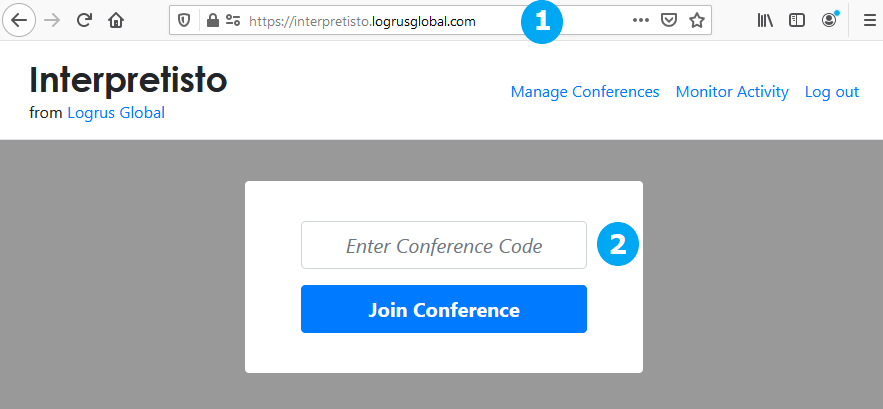

If you have the **Presenter** or **Attendee (Event Local)** role, you will enter the conference immediately.

However, if you have the **Participant**, **Interpreter** or **Attendee (Event Remote)** role, you will arrive at the conference connection screen:

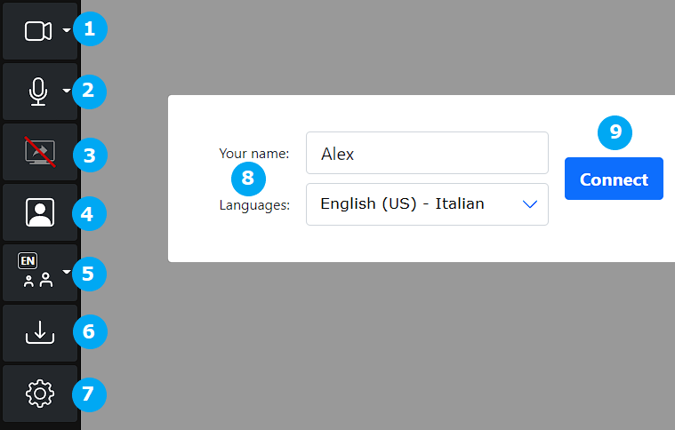

To the left, you can see the vertical panel used to set up the functions of your current conference. The avilability of these elements varies from role to role:

1. *Video streaming, with the drop-down menu for selecting the video source (such as any connected cameras)*
2. *Audio streaming, with the drop-down menu for selecting the audio source (such as any connected microphones, includng ones in your headset and camera)*
3. *Screen sharing*
4. *Camera view*
5. *Interpreting language*
6. *Additional materials download*
7. *Options*

If you have the **Participant** or **Interpreter** role, you will need to enter your username (8) before connecting. As an **Interpreter**, you will also need to pick a language pair.

Additionally, any **Interpreter** will be required to register an account in the **Logrus Global Localization Cloud** system (https://accounts.logrusglobal.com/?returnUrl=https://cloud.logrusglobal.com). If you're a conference creator and you need to have multiple **Interpreter** accounts set up, you can refer to the Cloud administrators.

When you are done, press the **Connect** button (9) to enter the conference.

## Available Functions

**Interpretisto** provides a unique set of available functions for each user role, as all of them differ in the types of data they can stream and receive.

It's important to note that the **Interpretisto** UI is adaptive, and will adjust to the available hardware and software, as well as conference settings. If your device does not have a connected webcam or another source of video streaming, the **Video Streaming** button will not appear in your UI even if your role enables video streaming. Similarly, if the conference has no language pairs selected - i.e., does not require interpretation - the **Turn interpretation on/off** button will not appear, and, if the conference does not include any additional materials, the **Download additional materials** button will not appear either.

### Presenter

As a **Presenter**, you can stream your video and audio, as well as share your screen.

You will have access to the additional materials of the conference (if any) via the **Download additional materials** button.

The **On Air** switch starts your presentation, enabling you to stream video and audio.

The following UI elements and functions are available to a **Presenter**:

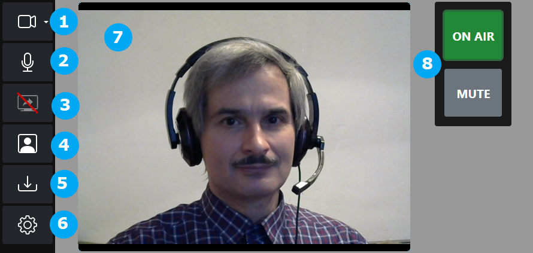

1. *Video Streaming On/Off and streaming source selection*
2. *Audio Streaming On/Off*
3. *Screen Sharing On/Off*
4. *My Camera View On/Off*
5. *Download Additional Materials*
6. *Options Menu*
7. *Video Streaming Window*
8. *On Air switch & Mute*

### Participant

As a **Participant**, you can, by default:

- Stream your video and audio;
- Share your screen;
- See and hear what the other **Participants** and **Presenters** are streaming and sharing;
- Access the chat.

If the conference has interpretation enabled, you will be able to choose your preferred language in order to hear the simultaneous interpretation being done for that language. Any other audio will be reduced in volume to 30%, by default, to make the interpreration easier to hear. You can change this reduction rate in the **Options** menu. A green light will appear on your **Turn interpretation on/off** UI button if an **Interpreter** of the appropriate language pair is online.

You will have access to the additional materials of the conference (if any) via the **Download additional materials** button.

The following UI elements and functions are available to a **Participant**:

1. *Video Streaming On/Off and streaming source selection (on this screenshot, the user has no video streaming source available, thus streaming is disabled as is the My Camera View On/Off button)*
2. *Audio Streaming On/Off*
3. *Screen Sharing On/Off*
4. *Participant Panel Show/Hide*
5. *Chat Window Show/Hide*
6. *Interpretation On/Off and interpretation language selection*
7. *Download Additional Materials*
8. *Options Menu*
9. *Participant Panel*
10. *Current Speaker View*
11. *Chat Window*
12. *Leave Conference*

### Interpreter

As an **Interpreter**, you can see and hear what the users with the **Presenter** and **Participant** roles are streaming in video (active speaker only) and audio.

You can stream audio in a specific channel, audible only to **Participants** and **Attendees** who have switched on the appropriate interpretation language option, as well as to other **Interpreters** of your language pair.

You can monitor the chat as well.

**Interpreters** belonging to the same language pair can talk privately. They can see and hear each other, and have access to a private chat, exclusive to the **Interpreters** of their language pair.

The **On Air** switch signals that you are prepared to start interpreting, enabling you to stream audio.

You will have access to the additional materials of the conference (if any) via the **Download additional materials** button.

The following UI elements and functions are available to an **Interpreter**:

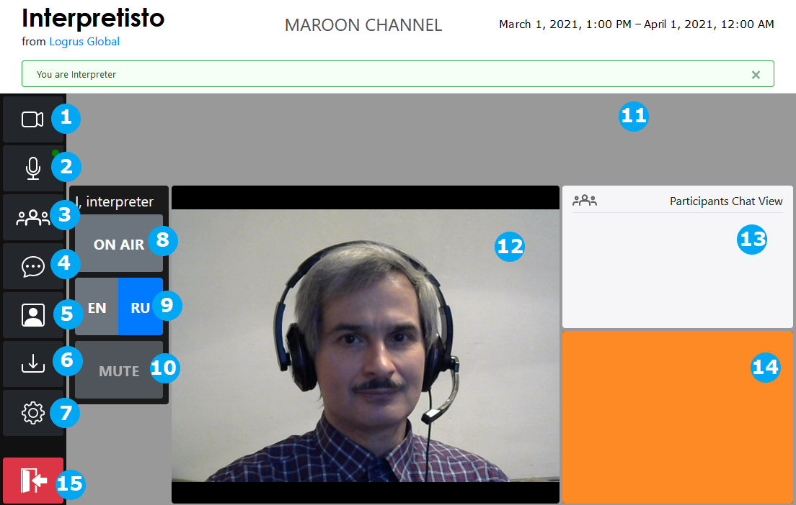

1. *Video Streaming On/Off and streaming source selection*
2. *Audio Streaming On/Off*
3. *Interpreter Panel Show/Hide*
4. *Chat Window Show/Hide*
5. *My Camera View On/Off*
6. *Download Additional Materials*
7. *Options Menu*
8. *On Air Switch*
9. *Interpretation language selection*
10. *Mute*
11. *Interpreter Panel*
12. *Current Speaker*
13. *Chat Window*
14. *My Camera View (present due to the My Camera View switch being put in the ON position)*
15. *Leave Conference*

### Attendee (Event Remote)

As an **Attendee (Event Remote)**, you can see and hear what the users with the **Presenter** and **Participant** roles are streaming in video and audio, as well as monitor the chat. 

If the conference has interpretation enabled, you will be able to choose your preferred language in order to hear the simultaneous interpretation being done for that language. Any other audio will be reduced in volume to 30%, by default, to make the interpreration easier to hear. You can change this reduction rate in the **Options** menu. A green light will appear on your **Turn interpretation on/off** UI button if an **Interpreter** of the appropriate language pair is online.

You will have access to the additional materials of the conference (if any) via the **Download additional materials** button.

The following UI elements and functions are available to an **Attendee (Event Remote)**:

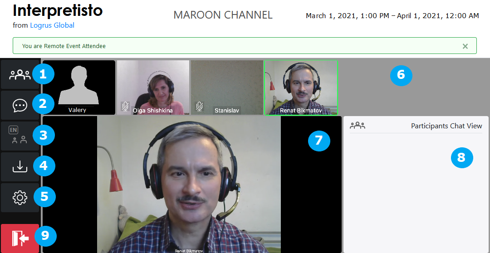

1. *Participant Panel Show/Hide*
2. *Chat Window Show/Hide*
3. *Interpretation On/Off and interpretation language selection*
4. *Download Additional Materials*
5. *Options Menu*
6. *Participant Panel*
7. *Current Speaker*
8. *Chat Window*
9. *Leave Conference*

### Attendee (Event Local)

As an **Attendee (Event Local)**, you can only listen to any available **Interpreters** that translate into the language of your choice.

The following UI elements and functions are available to an **Attendee (Event Local)**:

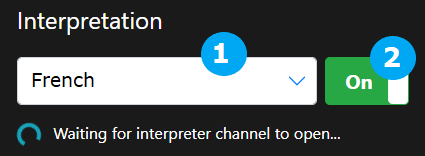

1. *Interpretation language selection*
2. *Interpretation On/off*

### Conference Manager

As a **Conference Manager**, you are enabled to set the parameters of the conference (or conferences) entrusted to you. This is elaborated in the chapter below.

When a conference is ongoing, the **Conference Manager** has access to the **Mute All** button (1), and can selectively **Unmute** (2) any of the participants, effectively turning the conference into a webinar with one or more unmuted participants as presenters.

## Managing Conferences

We've made the UI for managing conference to be as intuitive as possible. If you have been empowered to manage conferences, you can access the management page by simply clicking the **Manage Conferences** link in the upper right corner of the screen.

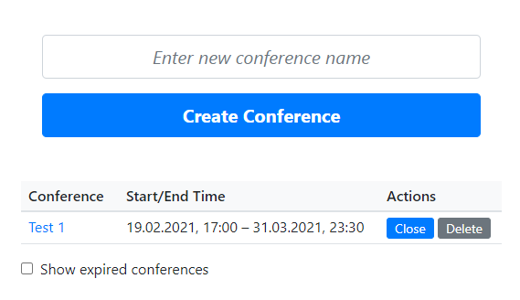
*The Management Screen*

Once there, you can create a new conference by writing its name in the text box and pressing the **Create Conference** button. If there are existing conferences, you can jump to the editing screen of a particular conference by clicking the link in its name, as well as close or delete them with the appropriate buttons.

*The Editing Screen*

On the editing screen, you can control every aspect of the conference:

- Set its name, or rename it at any time in the top section;
- Set the time period when the conference will be available using the **Schedule**  section;
- Set the language pair, or pairs, that will be used for interpreting - as many as you need, in the **Interpreted Language Pairs** section;
- Upload a picture to serve as a logo that all invitees will see in the top right corner of their UI, in the **Logo** section;
- Upload any files that you want your invitees (besides the **Attendee (Event Local)** role) to have access to, in the **Additional Materials** section;

In the top right corner of the UI, you will find a list of links and join codes. They are automatically generated for every available role in this conference, with the **Attendee (Event Local)** and **Interpreter** roles being enabled only for conferences with language pairs selected.

### Types of Conferences Possible

Interpretisto can be used for creating conferences of any kind. There are no strict pre-set rules, but possible variations include:

- A meeting-style conference of equal participants, with all users in the **Participant** role;
- A conference of equal participants, with users in the **Participant** role and some **Interpreters** invited;
- A webinar-type conference, with a single **Presenter** speaking, **Attendees** listening and **Interpreters** invited if necessary;
- A meeting/webinar hybrid, with both **Attendees** and **Participants**;

## Working with the MS Outlook Add-On

A new addition to the capabilities of **Interpretisto** is an add-on for the **Microsoft Outlook** e-mail management system. Its function is to set up scheduled conferences in **Interpretisto**.

To install this add-on, download our setup package, close Outlook and launch the executable. We are currently working on an easier installation-from-network process. .NET Framework Version 4.6 or higher is required (present in Microsoft Windows 10 by default).

Following the successful installation of the **Interpretisto** add-on, the **Interpretisto** item will become available in the **New Items** menu - both in the **Mail** and **Calendar** views:

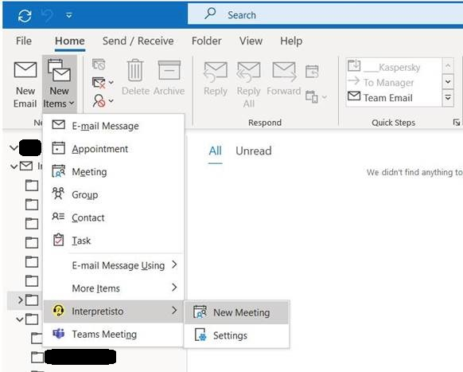

This item is a sub-menu, containing the **New Meeting** and **Settings** items. When you first select the **New Meeting** item, you will be prompted to set up your connection to **Interpretisto**:

By default, the **Server Address** and **ID Server** fields will contain our standard servers, and the **Login** field will be your current **Outlook** email. Enter the email and password that are valid for our Cloud Service, then press **Save** to set up your connection to our servers:

With your connection set up, selecting **New Meeting** again will call up a dialog for creating a new conference, with default invitation text and link filled in. As you fill in all the required fields and save this meeting to the calendar by pressing the **Send** button (which will also send the requisite invitee notices), a new, corresponding conference will be generated by the **Interpretisto** server (with the date and title as you'd set them):

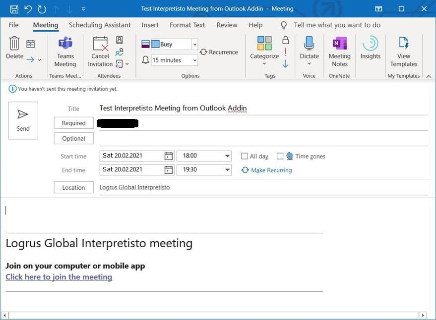

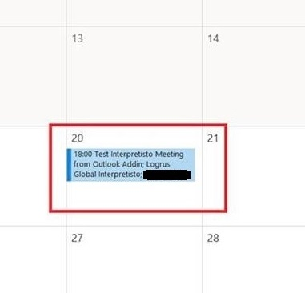

The **Manage Conferences** screen of **Interpretisto** will contain the new conference:

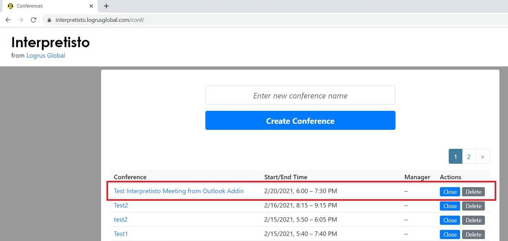

You can edit your new conference from that screen or from the **Outlook** calendar by double-clicking its corresponding record:

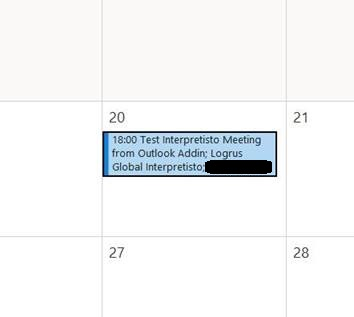

An editing form will appear. Conference parameters will be available there for editing; as you click the **Send Update** button, server-side **Interpretisto** data will be updated and all conference participants will be notified:

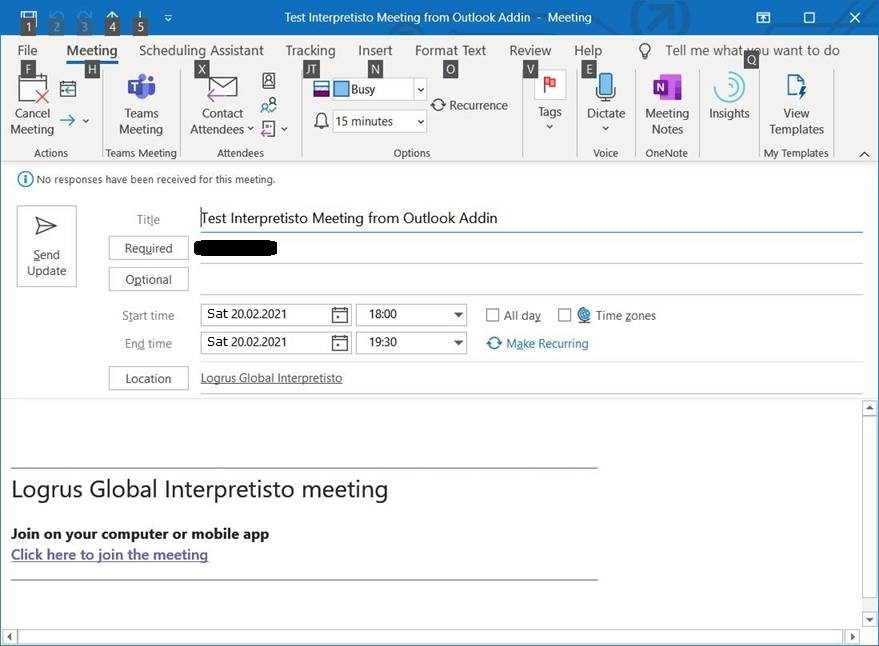

A conference may be cancelled from the cancellation form, available by selecting **Cancel Meeting** from the right-click menu in the **Outlook** calendar:

To confirm your decision, press the **Send Cancellation** button on the form. As you do so, the conference will be removed from the calendar and from the **Interpretisto** server:

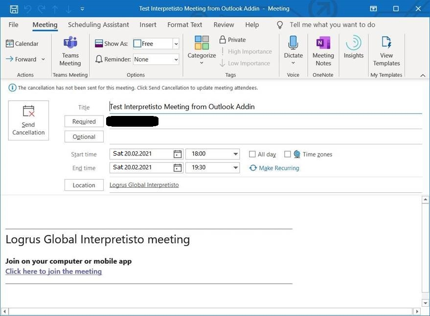

## Advanced Interpretisto Tips

### Sharing a single application window

You can share a single application window instead of your entire screen:

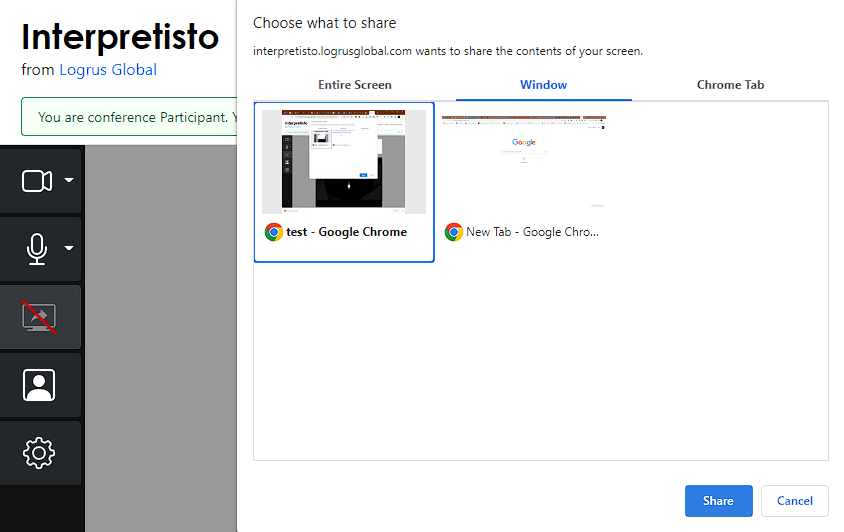

### Dealing with Audio and Video Delay

You can send your **Interpretisto** diagnostic data to the **Interpretisto Tech Support Team** to determine the cause of delays. Follow the instruction steps below:

1. Type **cmd** in the system search window and launch Command Prompt:

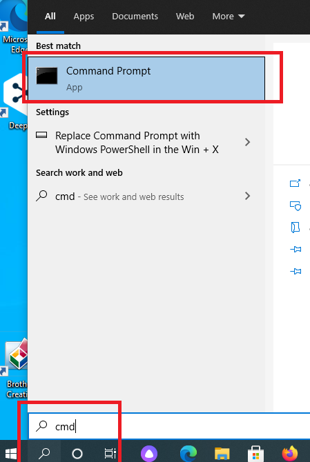

2. Type the following in the Command Prompt window: **tracert interpretisto.logrusglobal.ru**

Data strings will then be displayed, tracing the path of the signal.

3. Highlight and copy these strings, or take a screenshot. The Command Prompt window menu has a Copy option:

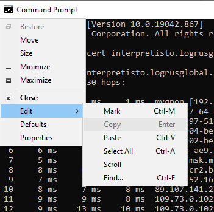

4. Send this information to tech support.