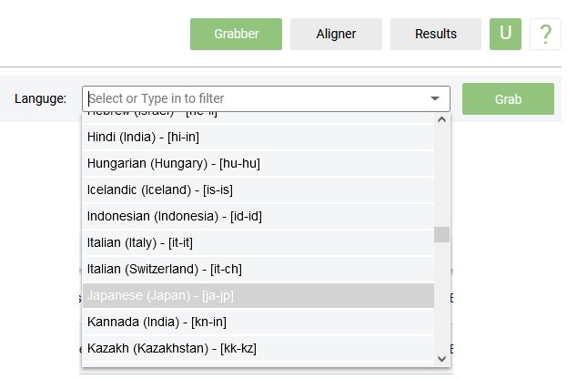
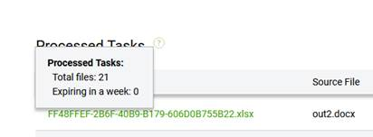
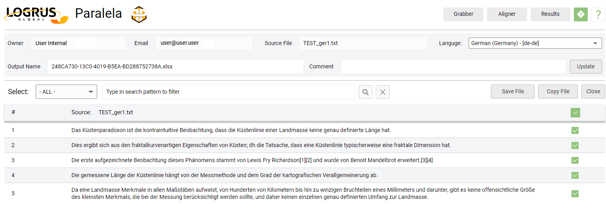

# Paralela: Bilingual Corpus Alignment and TM Generation Tool

Paralela enables you to create TM files from bilingual input streams such as TXT, DOCX or PDF files as well as websites.

Any combination of data formats and languages is possible.

# Paralela Use Cases

You can make good use of **Paralela** for the following tasks:

- Reuse of previously completed translations in cases when a TM does not exist or is difficult to find, but you still possess the source and target documents;

- Mining of bilingual knowledge from fuzzy sets of documents (corporate document repository = knowledge base);

- Mining domain-specific corpus from the Web, for custom MT training;

- Mining client-specific corpus from a (potential) customer's website;

- TM cleaning;

- Cleaning of existing MT training corpus;

# Paralela workflow in a nutshell

The usual steps of the Paralela workflow are as follows:

- Grabbing data from your input stream

- Reviewing and cleaning up the grabbed data

- Aligning the parallel texts

- Reviewing and editing the aligned output

- Downloading the TM file

## Data grabbing

Navigate to the *Grabber* tab to select the type of data source to grab from.

You can press *Upload* to grab from a file:

Or *URL* to grab from a website:

In case of using *URL*, you can also check the *Recursive* option to grab all subsequent pages starting from the provided URL, or leave it unchecked to only grab from the one page.

Next, select a language from the drop-down list:

Language is used by the *Grabber* component to select a set of rules to apply when automatically cleaning up and segmenting the grabbed content. 

With your data source ready, you can start grabbing data by clicking the *Grab* button:

*Note: the Grabber component operates tasks one by one, devoting all resources to the current one. Your tasks will be queued and then processed in order.*

The *Processed Tasks* table will contain all finished tasks:

These tasks can be filtered by a search pattern, and using the large checkmark at the table header will select them all at once:

Hovering over the '(?)' icon in this table displays expiration info for the files listed in it:

## Reviewing grabbed data

You can access the data that has been grabbed from a source by clicking on its item in the *File Name* column. On the screen that follows, you can review and edit the data:

After you are done with the particular set of data, press *Save Changes*. The original file will be overwritten, and the corresponding task will be moved to the *Reviewed Tasks* table: 

## Data alignment

Navigate to the Aligner tab:

You will see the following buttons:

- *Select* to select finished grabber tasks for the *Aligner*

- *Upload* to upload files

- *URL* to align websites

*Note: you can skip the earlier steps and provide files and URLs for grabbing data directly in the Aligner,  resulting in finished grabber tasks. In this case, the grabbing phase will be done automatically. This may save some time; however, this will likely result in lower quality and longer processing. We strongly recommend proceeding from the start of this workflow.*

You will need to designate grabber tasks as source and target for the alignment process. Do so by clicking on the corresponding fields and picking them from the dialog box that emerges:

*Note: You can select multiple tasks for both source and target, but the Aligner always creates one file as output. If you need to align many files one-to-one, send them for processing separately.*

Next, send the data for processing by clicking the *Align* button:

*Note: the Aligner component also operates tasks one by one, devoting all resources to the current one. Your tasks will be queued and then processed in order.*

When a task is ready, it is listed in the *Processed Tasks* table:

In a recent update, we've added a simple statistics display tool for alignment results. It is accessed by hovering the mouse over the '(?)' icon:

Additionally, the full list of grabber tasks used in an alignment may now be seen by hovering the mouse over the 'Source' or 'Target' in the table header:

## Reviewing aligned data

You can access the data that resulted from an alignment operation by clicking on its item in the *File Name* column. On the screen that follows, you can review and edit the data:

Searching can be done for the source or target fields separately, or for pairs:

After you are done with the particular set of data, press *Save Changes*. The original file will be overwritten, and the corresponding task will be moved to the *Results* tab:

## TM Downloading

You can download a TM file from the *Editor* by clicking the *TM* button:

# The Editor

Paralela includes a simple but powerful *Editor* to manage, review and clean up output data.

Depending on the module (*Grabber*/*Aligner*), the *Editor* has a somewhat different layout; however, the main features and principles remain the same:

- *Managing* – setting output file properties, such as project, domain, file name etc.

- *Filtering* – displaying data fitting a specific condition

- *Checking in/out* – switching on/off lines which should be saved with / removed from output file

- *Editing* – correcting the output text

## Managing file info

At the very top of the Editor form, you can find read-only and editable information, useful for the later stages of the workflow.

- You can find the source and target file names or website address

- You can set the *Project* and *Domain* values to filter your tasks at Results tab

- You must set the source/target languages to download a TMX file

- You can set a specific output file name, otherwise the guid will be used instead

- You can write a comment, which can be seen in the Results file table at the info panel of a file

To save information to the database, don't forget to click the *Update* button.

## Filtering via search

You can filter the data using a search query or with a predefined filter.

To display only the lines that contain a certain word or phrase, simply enter the query into the *Search* field:

You can use regular expressions to find and replace:

*Note: only the basic syntax is supported for regular expressions, with no delimiters and modifiers, assuming global and case-sensitive matching.*

Here are some links in case you need a refresher on regular expressions:

https://www.w3schools.com/jsref/jsref_obj_regexp.asp

https://en.wikipedia.org/wiki/Regular_expression

You can use the arrow buttons to find a next occurrence and replace it with the query from the *Replace by* field:

## Filtering by category

You can filter the data using predefined categories, such as *Matches ranges* or *Mismatches size*: 

For *Matches range* we are using a score which defines how the target sentence of an aligned pair is lexically close to a source sentence. There are four categories here:

- Equivalents – the same units occur in both source and target. By default, switched off.

- Best matches – well aligned sentences. By default, switched on.

- Good matches – lexically close, but not perfectly matching. By default, also switched on.

- Worst matches – all the rest. By default, switched off.

You can also display pairs which are of different size (in characters) by selecting the *Mismatching* option. The values for matching ranges and the size mismatching ratio are defined in project options:

## Checking in and out

While reviewing a filtered data set, you can check any of the pairs in or out by clicking on a check box:

You can switch all the filtered lines on or off at the same time by clicking the large checkbox at the table header:

To apply your selection, click the *Save Changes* button. The file will be overwritten, removing all the unchecked lines. 

## Editing

You can edit the text by double-clicking a text field in the table:

To finish editing, just click somewhere outside of the current text field or press ENTER.

# Projects

*Projects* are there help you to manage your tasks.

## Creating projects

You can create a new project at your account page:

Simply fill in the *Project Name* and optionally the *Comment* fields, then click the *Create* button. A project page will be opened, where you will be able to configure the options of your project:

## Using projects

You can use projects to filter your tasks at the *Results* tab:
