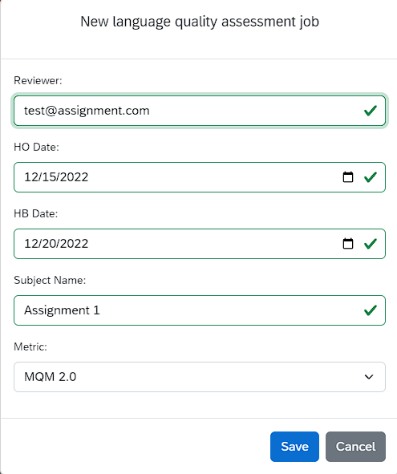

# Perfectionist: a cloud-based LQA Tool

**Perfectionist** is a Web service for measuring translation quality, post editing quality, and raw machine translation quality. 

With this service you can:
- Outsource LQA tasks to internal and third-party experts
- Keep track of reviewes in the LQA reports repository
- Download LQA reports

For translation quality evaluation, you can use several embedded quality metrics:
- standard LQA metrics based on MQM error typology
- advanced LOGIPEM metrics for most adequate and precise quality evaluation of raw and post edited machine translation
- any user-defined metrics (by request)

The service is built in accordance with the most recent proceedings of ASTM International Committee F43 featuring an advanced analytic-holistic LQA methodology.

For enterprises, any customizations of the service functionality can be provided upon request.

## Supported File Formats

You can review bilingual files of the following formats: 
- **XLSX** (a sample is available on the requestor page)
- **XLIFF**

# User Account and Role

**Perfectionist** uses the same user accounts as the https://cloud.logrusglobal.com/ portal. 

A user will have one of two roles: **Requestor** or **Reviewer**.

## Requestor

A **Requestor** can create review jobs (at https://lqa.logrusglobal.com/requestor-room) by clicking the **New Job** button on the **Requestor tab**.

If you don't want to review the whole file, you can get a sample with a certain number of words less than the number of words in the file. The **Requestor** can set the sample size after uploading the file using the **Sample size** field above the table. After entering the desired sample size, click the **Resample randomly** button.

When you create a LQA job as a **Requestor**, you need to assign a **Reviewer** by submitting their email. If there isn't a Cloud account for a submitted email, it is created with **Reviewer** rights automatically.

A **Requestor** can also choose a metric to use in the review: currently we have implemented two metrics, **MQM** and **LOGIPEM**. Any user-defined metrics can be implemented by request.

## Reviewer

After a job is created, the **Reviewer** is sent an email with the link to new LQA review task. 

As a **Reviewer**, if your account had just been generated, you will be promted to create a new password. Then, the **Review** table will be opened in the browser, with the following columns: **Source**, **Target**, **Errors**, and **Reviewed**. The **Reviewed** checkbox is set automatically each time any translation error is logged in given translation unit, or manually when the unit is fully reviewed. 

You will be required to compare each of the **Source** and **Target** lines. If there is an error,you will need to highlight the erroneous text fragment.

A pop-up window will appear on screen when you highlight a fragment. There, you will be able to suggest a correct translation or enter a comment; but, most importantly, you will need to pick a **Category** and a degree of **Severity** for each error.

A **Reviewer** can mark several errors in each translation unit, and their selections may overlap.

Upon completion of the review, the task should be marked as completed using the **Finish Review** button. A pop-up window will appear for entering a general conclusion on the file, which will be available to the **Requestor**.

# Downloading the LQA report

As the review process is finished, the **Reviewer** marks the job as complete. Then, the results become available for **Requestor** to view and download as the **XLSX** scorecard with selected metrics.

