# Rigora: The Ultrapowerful QA Tool

**Rigora** is an ultrapowerful desktop localization QA tool.

Built on top of decades of localization engineering experience of the Logrus software developers and engineers (and recently, completely rewritten and drastically improved), **Rigora** enables you to perform the most advanced technical and linguistic checks on localized files, to fix errors interactively, and to do so in batch mode. **Rigora** can work with entire projects, as well as with singular files, making it an extremely convenient default editor for the XLIFF file format.

It is an interactive tool, and it ranks among the most powerful tools for working with software and text content.

You can visit the official website of **Rigora** here: [www.rigora.studio](http://www.rigora.studio)

# Release Notes

## Version 2.0: November 24, 2022

**Features introduced in this version:**

- Extended hypertext tag support;

- Revamped and expanded check customization capabilities;

- All-new capability of compound logical check combinations;

- Spelling: tags will no longer confuse the spell checker;

**Hypertext Tags**

Tags belonging to different categories will now be displayed differently:

- XML tags ( <…> </…> <…/> )

- Hypertext entries ( &…; )

- Breaks ( \n \r \t )

- Placeholders ( {…} %… )

**Check Customization Capablilities**

- Most of the check types can now be combined using logical operators (AND, OR, NOT). The **Check Property Editor** now displays a logical expression made of checks and operators as a tree;

- Checks will generate localization error alerts inside the text as wavy underlines, and will add their own wavy underlines to messages created earlier by different checks;

- By default, checks now have a set of constraints that can be disabled if necessary. For example, the "Source does not equal target" constraint serves to speed up checking during translation work, as it cuts off the overabundance of false-positive Partially untranslated, Spell check and GAR alerts;

- The context menu on the **Check Results** panel now has the **Go To Check** command for instant access to the check (on the **Check** panel) that had caused a particular alert;

- The **Search Scope** option can now be used for searching in the text or the tags separately, or in the text and tags at the same time;

- Several **GAR** checks can be run at the same time, each with its own glossary and excludes;

- Spell check will now run faster;

- The **Ignore Untranslated Words** option has been added spell check, intended to reduce the amount of false-positive alerts, and is enabled by default;

- Possible fixes are shown in the context menu of the **Check Results** panel, and will automatically replace the erroneous text when selected;

# Supported File Formats

- Common bilingual file formats (**SDLXLIFF**, **TMX**, **TTX**, **XLIFF**)
- Special bilingual file formats (**TSV**)
- Excel workbooks (**XLSX**)
- Any **XML** and **delimited text (TXT)** formats by means of embedded configurable parsers

*Some of the file types supported by Rigora*

# Projects

**Rigora** supports two types of projects that differ from each oher drastically, including the difference with their handling of files: projects with embedded changes and projects with in-file changes (absolute and relative). Each project may support a folder structure with possibly thousands of files, if necessary.

A project with embedded changes does not make any changes to its files, saving all changes to the main RIGORA file. It is possible to export its document files with changes included via the Project menu.

A project with in-file changes contains only a list of file locations and settings, with all the changes going directly into its files.

**Rigora** can also be used to simply work with a single file of a supported format without creating a project, if you so choose - possibly while associating XLIFF files with Rigora in Windows.

# Checks

**Rigora** may run a large variety - more than 300 in total - of checks on the files within its projects. Among them are:

- Common checks (punctuation, tag and placeholder matching, etc.), configurable for various language pairs

- Check for invalid characters based on the target language alphabet

- Check for partially untranslated source words

- Consistency check, direct and reverse

- TM consistency checks

- Glossary Adherence Review (GAR) with stemming support, checking against external glossaries as well as in-project (using all project translations as a glossary) to verify the correct translation of all terms

- Checks for prohibited terms

An important quality of **Rigora** is that it will load all active files into the memory. Its checks are accomplished via in-memory processing, which ensures extremely fast checking, even for very large projects comprised of thousands of files.

You can add or remove checks, as well as customize their properties from the **Checks** window:

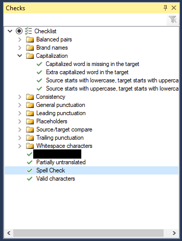

You can run all the checks from your check tree at once, or choose individual checks to run.

After running a check, you can export the resulting report as an XLS file.

## Glossary Adherence Review (GAR)

Here is an example of checking consistency of project translations against a bilingual **TMX** file as a glossary.

Right-click **Checks** window to create new check and select the **Add > New Check** option:

On a toolbar, click **GAR**:

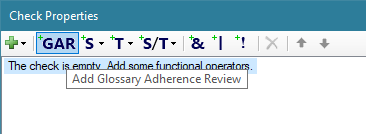

Click to select the glossary **file format**:

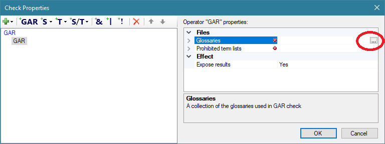

Click to select the **glossary file**: 

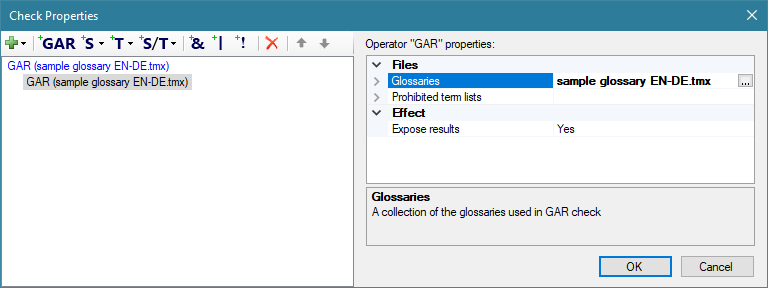

Now you can launch the new check by right-clicking it and selecting the **Run** option. 

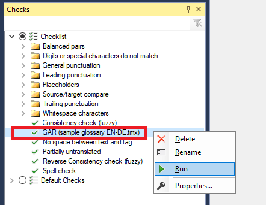

Any other check can be launched the same way.

### How to fix incorrect term translations found by GAR

As you run GAR checks in **Rigora**, you are able to copy and paste the correct term translations from the glossary into one or more translation strings.

Click any error message string at the **Check Results** panel while holding down ALT key. The correct translation(s) suggested by GAR will be copied to the clipboard. Then you can click the respective target column at the main panel and paste the correct translation there.

## In-place Editing

As you run your chosen set of checks, individual errors are displayed in the **Check Results** window.  

As you walk through them, they are highlighted in the files. For each error, **Rigora** will activate the file and highlight the string that contains it. When an error is fixed, it is removed from the **Checks Results** window.

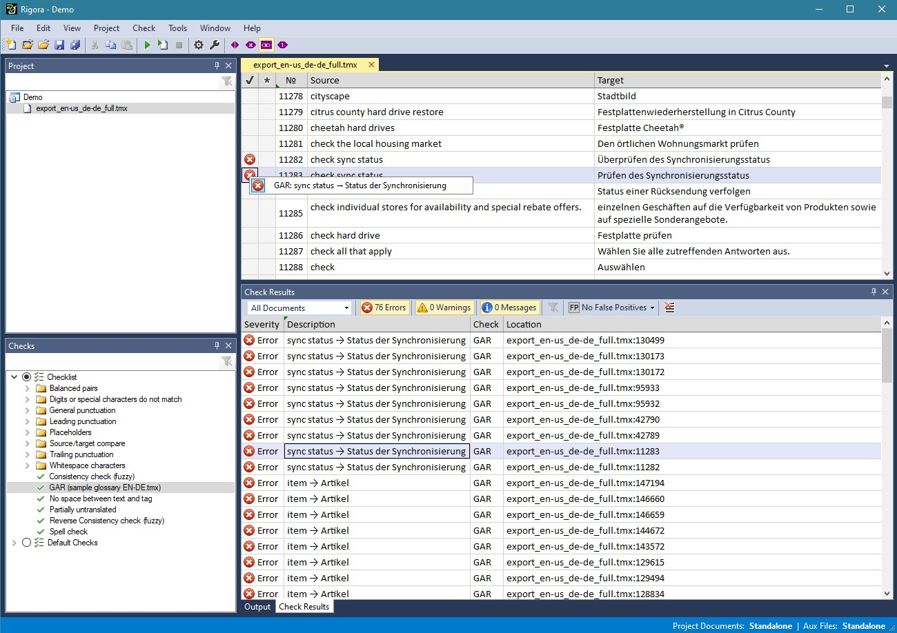
*Rigora found a problem with terminology*

As soon as the translation is fixed, **Rigora** automatically re-checks the translation unit.

Not all types of checks support in-place editing (consistency and reverse consistency checks do not).

## False Positives

You can right-click an error in **Check Results** panel and mark it as **False Positive**. The error will then be removed from the list.

## Spell Checking
**Rigora** offers two primary methods of spell checking.

By default, for **Windows 8+**, it uses your system API to employ the **Basic Typing** component that is present in a lot of the **Microsoft** language packs. You can check the **Language** settings menu in **Windows** to see if the **Basic Typing** component (visualized as the ABC-and-checkmark symbol) is present for the language pack(s) that are present in your system.

Spell checking behavior in general is governed via the **Spell Check** item in the **Checks** menu:

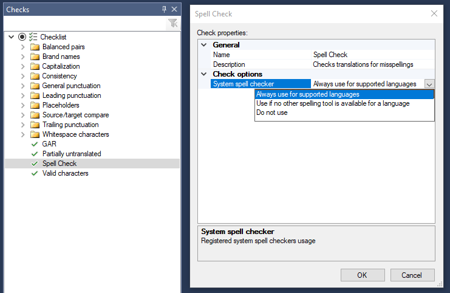

You can enable one of the following options for the **System spell checker** item:

- **Always use for supported languages** (default option): **Rigora** will first check if your system has any support for spell checking in the required language, and will use **Windows** spell checking if it is available. Otherwise, Rigora will look for other options (Hunspell dictionaries with an enabled **Use for spelling** option);

- **Use if no other spelling tool is available for a language**: **Rigora** will do the opposite, checking for user-set spell checkers (**Hunspell**) first and looking for a **Windows** component if none are available;

- **Do not use**: no spell checking.

To check your spelling, right click the Spell Check item in the Checks window and select Run:

Rigora will then highlight any misspelled words in Target.

### Windows Spell Checker
**Rigora** uses the Windows spell checker by default:

*System spell checker is on by default*

To enable this, the document language must be the default system language (check Start > Settings  > Time & Language > Language).

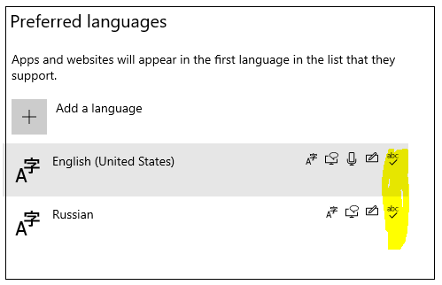

### Hunspell Dicrionaries
You can also use Hunspell dicrionaries to check spelling. The dicrionaries are set up separately.

Currently, you can use **Hunspell** (http://hunspell.github.io/), but we intend to add more capabilities as **Rigora** is developed further.

**Hunspell** dictionaries can be connected to **Rigora** via the **Options** -> **Tools** -> **Hunspell** menu. Here, you can also decide if your connected **Hunspell** dictionaries are to be used by **Rigora** for stemming and/or for spell checking.

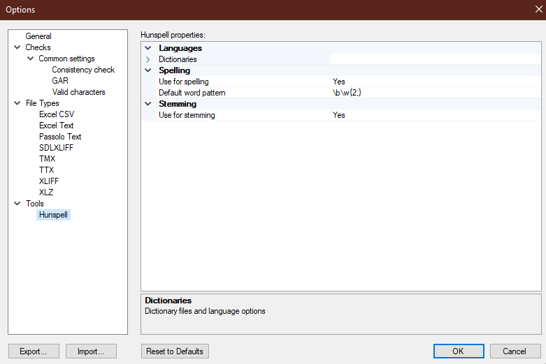

# Content Export / Import

**Rigora** is very good at exporting various file formats. For example, you can export the contents of a XLIFF file as an Excel, Word or TMX file, or export unique records only to remove duplicates.

# Regular Expressions

You can employ **.NET regular expressions** (as described here: https://docs.microsoft.com/dotnet/standard/base-types/regular-expressions) in **Rigora**, greatly expanding the capabilities of what can be achieved using our product.

Here's a small example: if you need to find every string that is missing spaces after comma or ending dot in the Target sentence, you can use the following check:

Operator: "Target contains", Pattern: ([^0-9]\,[^ \W])|([^0-9]\.[^ com0-9[\W]), Pattern type: Regular expression, Case-sensitive: No

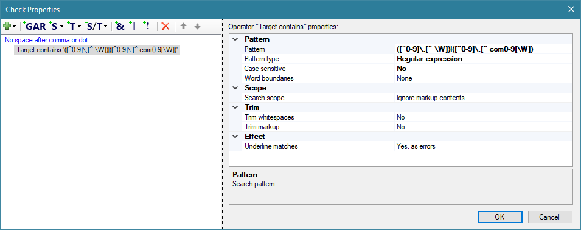

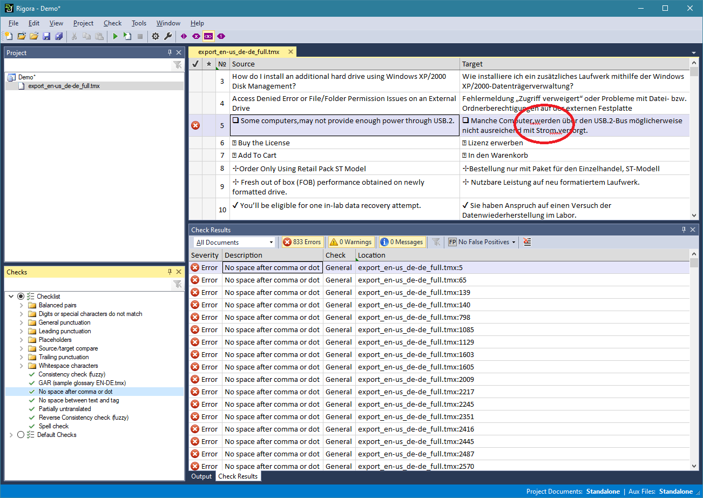

# Displaying and Editing Locked Tags in SDLXLIFF Files

You can find the **Include Locked Content** and **Save Modified Locked Content** flags in the **SDLXLIFF** section of the **Project Properties** window.

If you want to have the locked content inside SDLXLIFF files displayed and available for editing, switch these flags to **YES**.

# Keyboard Shortcuts

While working with Rigora, you can use the following bound keys and shortcuts:

- **Home / End**: jump to the first / last cell of the currently selected record;

- **CTRL + Home / End**: jump to the first / last record of the currently open document;

- **CTRL + PgUp / PgDn**: jump to the first / last record of the currently viewed document page;

- **CTRL + Up / Down / Left / Right (*arrow keys*)**: scroll the document window one row/column in the direction of the arrow;

- **CTRL + Insert**: copy the contents of Source to Target in the currently selected record;

- **ALT + N (*where N is a numeric key corresponding to a tag that is present in Source, from 1 to 0(10)*)**: place a numbered tag into Target, at cursor position.

# Use Cases

## Software Updates

When translating software, **Rigora** can do 100% matching updates of software strings, autotranslate ICE matches by TMX files (“software dictionary”, translated before).

## Keeping Track of the Translation Editing History at Every Stage, for Every Document Format

It is often necessary to keep track of how an editor makes changes to the document after receiving it from the translator - as well as keeping track of the document, in general, at all stages of the translation process. This is relevant for regular editors as well as MT post-editors. CAT tools often do not keep track of who exactly changes what (sometimes they do, but the process is often inconvenient).

**Rigora** solves this issue through its new function. It is used to covnert a duolingual XLIFF file into a MS Word document containting a table with two columns: source and translation. XLIFF files can be obtained easily from most CAT tools, as they enalbe the user to export a project as a set of XLIFF files at any stage of the project. So, in order to compare two versions of a document from different stages of its project, you can simply convert the XLIFF files to the DOCX format and then use the standard document-comparing function of MS Word. If you do a XLIFF export of your CAT project after the translation is done, and then another after the editing is done, you will be able to visualize everything that the editor had deemed right to fix in every document. 

*You can convert a XLIFF file into a DOCX file using the File -> Export Items option with the Word Document file type.*

*This is what a DOCX file covnerted from XLIFF looks like.*

*Use the Review -> Compare option in MS Word to compare the changes between two DOCX files belonging to different versions of a document.*

Most CAT sytems do not offer the means of viewing versions of a document from different project stages, let alone a convenient way to view a history of changes. Making project snapshots in XLIFF format is an easy-to-use solution, available to everyone. 

The XLIFF format is especially convenient, as it enables visualizing a history of changes made to files of any format during the translation process. If you elect to use the XLIFF-to-DOCX convertion, you will be able to:

- give edited files back to your translators for future reference, with any mistakes commented on in the DOCX files by the editors

- provide your layout designers with clearly pointed out last-minute fixes for translations

- evaluate the work of your MT post-editors

- snapshot any translations out of your CAT system and provide them to your reviewers for checking in the simple DOCX format - without the trouble of arranging their access to your CAT system (or training them in its use)

## Machine Learning Data Cleaning

**Rigora** is indispensable in machine learning and data cleaning.

It supports the **TSV** file format, which is a standard for ML training and inference, and is capable of using regular expressions to clean data, as well as 300 different types of filters.

