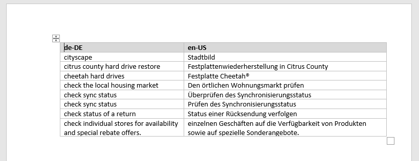

# Rigora: The Ultrapowerful QA for bilingual files

**Rigora** is THE most powerful technical and linguistic quality assurance (QA) tool to support localization of software and other content into any language.

Please, visit [www.rigora.stido](http://www.rigora.studio) web site for more details about the tool.

## Keeping Track of the Translation Editing History at Every Stage, for Every Document Format

It is often necessary to keep track of how an editor makes changes to the document after receiving it from the translator - as well as keeping track of the document, in general, at all stages of the translation process. This is relevant for regular editors as well as MT post-editors. CAT tools often do not keep track of who exactly changes what (sometimes they do, but the process is often inconvenient).

**Rigora** solves this issue through its new function. It is used to covnert a duolingual XLIFF file into a MS Word document containting a table with two columns: source and translation. XLIFF files can be obtained easily from most CAT tools, which enalbe the user to export a project as a set of these files, at any stage of the project. So, in order to compare two versions of a document from different stages of its project, you can simply convert XLIFF to DOCX and then use the standard document-comparing function of MS Word. If you do a XLIFF export after the translation is done, and then another after the editing is done, you will be able to visualize everything that the editor had deemed right to fix in the document. 

*Convert a XLIFF file into a DOCX file using the File -> Export Items option with the Word Document file type.*

*This is what a DOCX file covnerted from XLIFF looks like.*

*Use the Review -> Compare option in MS Word to compare the changes between two DOCX files belonging to different versions of a document.*

Most CAT sytems do not offer the means of viewing versions of a document from different project stages, let alone a convenient way to view a history of changes. Making project snapshots in XLIFF format is an easy-to-use solution, available to everyone. 

The XLIFF format is especially convenient, as it enables visualizing a history of changes made to files of any format during the translation process. If you elect to use the XLIFF-to-DOCX convertion, you will be able to:

- give edited files back to your translators for future reference, with any mistakes commented on in the DOCX files by the editors

- provide your layout designers with clearly pointed out last-minute fixes for translations

- evaluate the work of your MT post-editors

- snapshot any translations out of your CAT system and provide them to your reviewers for checking in the simple DOCX format - without the trouble of arranging their access to your CAT system (or training them in its use)