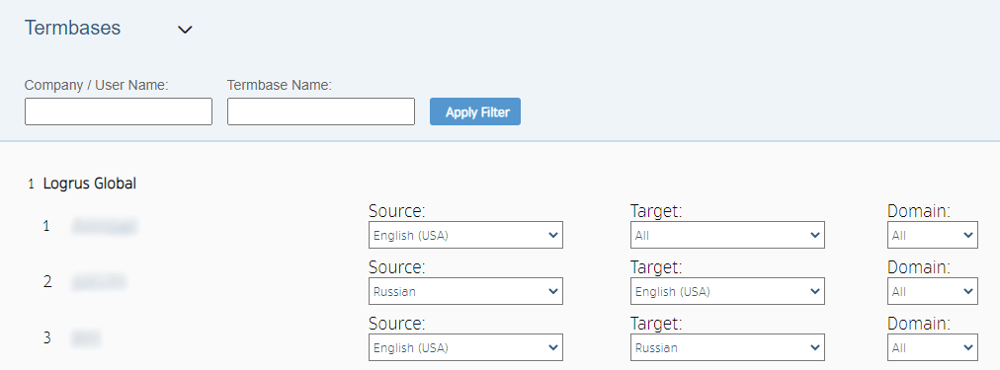

# The TermLode Application Family

The **TermLode** application family is a client-server, cloud-based terminology database solution designed for corporate use.

It is comprised of the following applications:

- The **TermLode** terminology database;
- The **Omnitran** Search application;
- The **Prospector** Terminology extractor;
- The **TermLode** Trados connector.

In the sense of achitecture, it has the following components:

- The **TermLode** termbank;
- The **TermLode** Cloud Front End;
- The **Omnitran** Cloud Front End;
- The **Prospector** Cloud Front End;
- The **TermLode** **Trados** Connector DLL.

## Data Model

The **TermLode** data model conforms to the TBX standard (ISO 30042). There’s a Concept in the root hierarchy, and terms in various languages are descendants from the root, as shown on the figure:

There's a One-to-Many relationship between a **Concept** and multiple **Terms** is any language, and a Many-to-Many relationship between **Terms** in different languages. This data model reflects the situation when one source term can have several terms for a target language and vice versa.

## User Experience

### TermLode

As you enter the **TermLode** page, the **Terminology Database Manager** will be the first screen you see. 

This screen displays all the **termbases** available to you, grouped by company name. Company names (1), as well as the **termbases**' own names (2) may be used to filter the list of **termbases**.

By default, the **Database Manager** screen is in the **termbase** listing mode. Using the menu (3), you can switch between that and the **termbase** creation mode:

You can simply enter the name of the new **termbase**, pick the source and target languages and press the **Create New Termbase** button to create a new empty **termbase**.

Click the name of a **termbase** to enter the **Terminology Database** screen:

The **Term Filter** takes up the top of the screen. It can use any of the variables that make up a term to populate the **List of Terms** below:

- Source strings and languages;
- Target strings and languages;
- Business domains that terms belong belongs to;
- Term types (acronym, concept etc.);
- Parts of speech that are used as terms;
- Prouducts that the terms belong to;
- Modules;
- DNT (Do Not Translate) status;
- Approval status;
- Client.

The **Apply Filter** button populates a new **List of Terms** in accordance with the **Term Filter** settings.

The **Term Filter** also includes the **Export** and **Export TBX** buttons that are used to create and download a XLSX or a TBX file (respectively) containing the terms from the filtered **List of Terms**.

The **List of Terms** will show a One-to-Many relationship between the source term and the target terms in multiple languages if the **Term Filter**  is set up for multiple target languages. When you click a source term in the **List of Terms**, the Edit dialog box opens and shows the full multilingual One-to-Many hierarhy - from the **Concept** down to the **Terms** in various languages. You can add new **Terms** in any of the languages already present, or select a new language for adding a term.

The **+ New Term** button at the top right edge of the **Term Filter** calls a dialog window where you can define a new **Concept** and populate it with **Terms**. You are not limited in the number of **Terms** or the languages you can use.

Selecting any number of terms with the checkboxes on the left side of the **List of Terms** and pressing the **Delete Selected** button will delete them from the **termbase**.

The drop-down menu over the **Term Filter** is used to switch the top frame between the **Term Filter** and other vital functions:

- The Settings menu, where you can set the name of the **termbase**, as well as its default source and target languages and domain;

- The Import menu, where you can import terms via XLSX files (example file is provided via download link);

- The Users menu, where you can see the list of uses that have been invited to this **termbase** in various roles, as well as invite new users. To do that, enter the first and last name of the user and their email, select the role that will be conferred to them, and press the **Invite User** button.

### OmniTran

The **TermLode** data model organizes collections of **Terms** into **Glossaries** by client, as well as by topic. **Omnitran**, a glocal search front end web interface, enables you to carry out searches for a **Term** across multiple **Glossaries** at once.

You can select just a single **Glossary** or source/target language, or any number of them at once. You can also divide one of the selected **Glossaries** into alphabetical sections by pressing the **A-Z** button:

### Prospector

## Architecture

**TermLode** has an SQL-based backen and a .NET-based frontend, which is an ideal architecture for cloud deployment:

**TermLode** can only be accessed by users via browser, as it is a completely web-based, cloud-ready application.

**TermLode** is built as a corporate application, implementing an ID service and roles to control access for various groups of users with different rights. 

The current roles are:

- Global Administrator
- Corporate Administrator
- Corporate User/Editor
- Terminologist
- Super Editor
- Super Terminologist
- Super Reviewer
- Viewer/Reviewer

